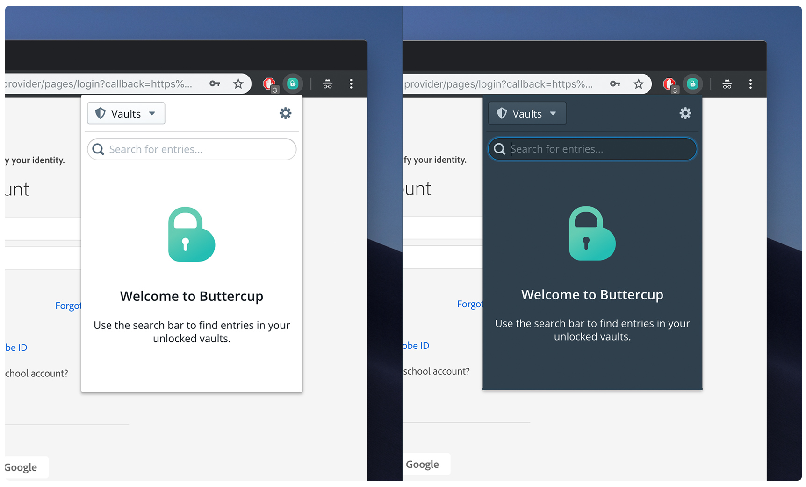

<h1 align="center">
   
  
   
   
   
</h1>

# Buttercup Browser Extension
Buttercup credentials manager extension for the browser.

    

## About
This browser extension allows users to interface with password archives authored by the [Buttercup password manager](https://github.com/buttercup-pw/buttercup) (though it **does not** require the application to be installed).

The extension can remotely connect to archives via Buttercup's common communication protocols (WebDAV, Dropbox etc.).

### Supported browsers
Current only **Chrome** is supported.

We **hope** to add support for Firefox and Edge in the near future - We'd love any suggestions or contributions in this area!

### Adding to Chrome
You can load an **unpacked extension** in Chrome by navigating to [chrome://extensions/](chrome://extensions/). Simply locate the project's directory and use **dist/** as the extension directory.

## Contributing
Contributions are very welcome and strongly encouraged, though we do ask that you stick to some basic styling parameters:

 - Use **4 spaces** for indentation
 - New line at the end of each file
 - Commas on same line (at end)
 - Semicolons are not optional
 - _(Just follow the editor config and existing styles)_
